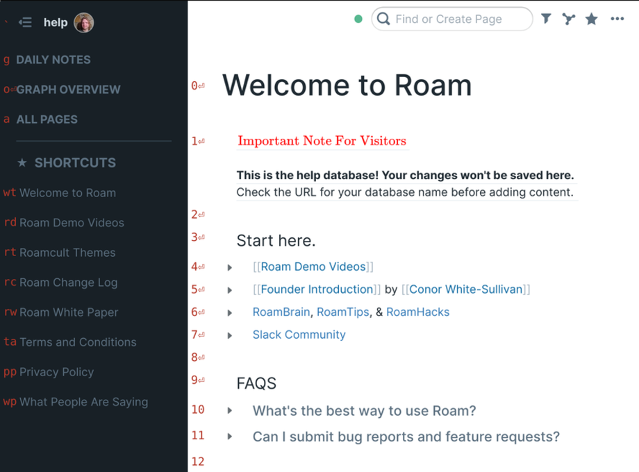

# Roam Navigator

Wherever you may [Roam](https://roamresearch.com/) :metal:, it is
essential to have an efficient navigator.

Navigation mode is initiated by pressing `alt-g`, or just `g` when not
editing text. Navigation keys will then appear, which can be typed to
select the corresponding elements:

While navigating, the following shortcuts will also be available:

* `Space` to scroll down half a page

* `Shift+Space` to scroll up half a page

* `Down Arrow` to scroll down a bit

* `Up Arrow` to scroll up a bit

* To scroll the sidebar, first type `s` followed one of the above
  scrolling shortcuts.
