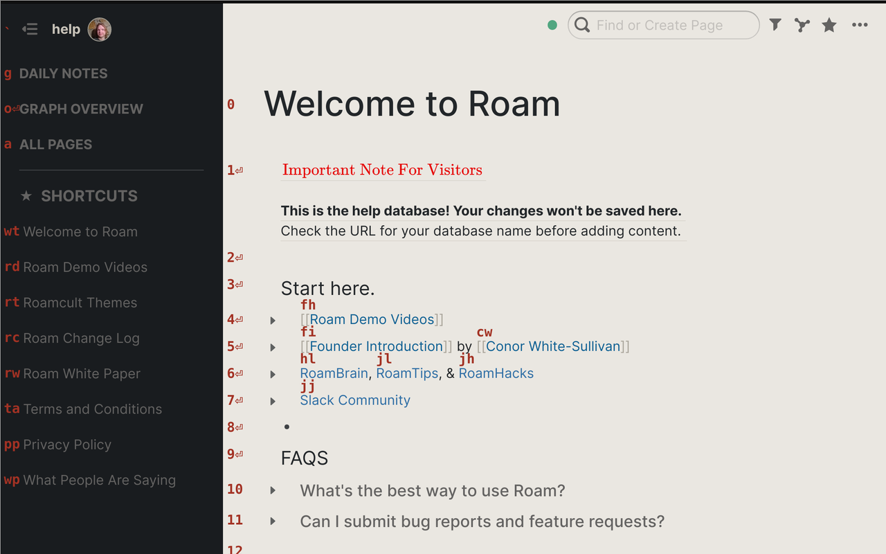

# Roam Navigator

Wherever you may [Roam][] :metal:, it is essential to have an
efficient navigator. This browser extension adds a navigation mode to
[Roam][] which presents visual navigation hints, that can be typed in
order to select the corresponding link, block, or button.

* [ Extension for Google Chrome
  ](https://chrome.google.com/webstore/detail/todoist-shortcuts/jdnejinifclpmdnhchmadmjcmcjpcpbj)

<!--
    
    
-->

* [ Extension for Mozilla Firefox
  ](https://addons.mozilla.org/en-US/firefox/addon/roam-navigator/)

<!--
    
    
-->

By default, navigation mode will be active when no input is focused.
It can also be initiated by pressing `Alt+g`, or just `g` when not
editing text. Visual navigation hints will then appear, allowing you
to select links, starred pages, and select blocks to edit.

Navigation mode is similar to the generic link clicking feature found
in extensions like [Vimium][] or [SurfingKeys][], but it does the
following things better for the Roam usecase:

1. Uses stable key sequences for left sidebar and editing blocks in
   your page.  Attempts to use stable key assignments for clicking
   links in your page.

   - Stable key sequences for your starred pages mean that you can
     navigate to them even when the sidebar is not visible!

2. You can open pages in the sidebar, by holding `Shift` while typing
   the last character of the navigation hint.

3. It attempts to have more integrated visual layout of the hints,
   fitting them into the margins.

4. Position of the hints update with scrolling and other page
   updates. In particular, when in navigation mode you can use the
   keyboard to scroll the main page with `Space`or `Shift+Space` to
   scroll half a page, and `Down` / `Up` arrows to scroll a bit.

   - To scroll the sidebar, first type `s` followed by the above
     scrolling shortcuts. `s` is used as a prefix for selecting links
     / blocks in the sidebar.

5. By default, navigation mode is enabled on start, and enabled when
   focus exits input. You can then press `Escape` while editing a
   block to enter into navigation mode. This behavior can be disabled
   in the options if you prefer to press `Alt+g` / `g`.

[Roam]: https://roamresearch.com/
[Vimium]: https://vimium.github.io/
[SurfingKeys]: https://github.com/brookhong/Surfingkeys

# How to install

This extension has not yet been published to Chrome Webstore or
Firefox Add-ons, since there's a possibility it might get directly
included in the [Roam Toolkit
extension](https://github.com/roam-unofficial/roam-toolkit) - see
[this issue in Roam Toolkit's
tracker](https://github.com/roam-unofficial/roam-toolkit/issues/91).
So, in the meantime, it can only be used as an unpacked extension:

## Chrome

1. Go to: [**chrome://extensions**](chrome://extensions)
2. Toggle: "**developer mode**" on.
3. Click on: "**Load unpacked**"
4. Select the **src** folder in this repo (no build step needed!)

## Firefox

1. Go to: [**about:debugging**](about:debugging)
2. Select: "**Enable add-on debugging**"
3. Click on: "**Load Temporary Add-on…**"
4. Select the **src** folder in this repo (no build step needed!)

Roam Navigator's icon was made by [Pixel
perfect](https://www.flaticon.com/authors/pixel-perfect) from
[www.flaticon.com](https://www.flaticon.com).
